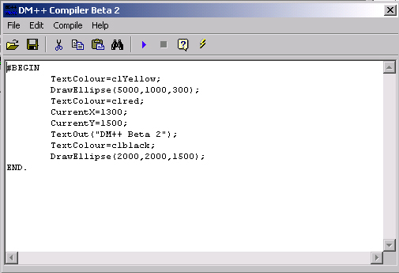



## DM\+\+ Programming Language

### Description

Hi This is my fisrt ever time at trying to make a Programming Language of my own and it's har form finished I did place this here but For and then Removed cause i Needed to make some changes andyway it's back now and with more new commands I'ts still not as good as other compilers on here Like D++ and Jel but in time it will pick up and way I hope you like it please vote if you do.
 
### More Info
 

             |
---                |---
**Submitted On**   |2001-01-16 22:11:46
**By**             |[dreamvb](https://github.com/Planet-Source-Code/PSCIndex/blob/master/ByAuthor/dreamvb.md)
**Level**          |Intermediate
**User Rating**    |3.2 (16 globes from 5 users)
**Compatibility**  |VB 6\.0
**Category**       |[Complete Applications](https://github.com/Planet-Source-Code/PSCIndex/blob/master/ByCategory/complete-applications__1-27.md)
**World**          |[Visual Basic](https://github.com/Planet-Source-Code/PSCIndex/blob/master/ByWorld/visual-basic.md)
**Archive File**   |[CODE\_UPLOAD138031152001\.zip](https://github.com/Planet-Source-Code/dreamvb-dm-programming-language__1-14442/archive/master.zip)

